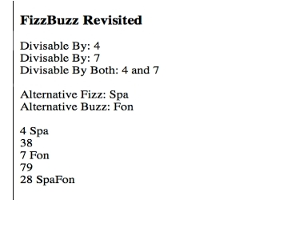

#xOrdered Name

Using the image below, write an HTML form which has fields for first name, middle initial, and last name, 
plus the selected order radio button.

The HTML form when submitted sends the first name, middle initial, last name, and order to **/xOrderedResult**. 

The controller action receives the submission and outputs a new view with the appropriate name format.

#Colorized Name

Usin the image below, write an HTML form which accepts the first and last names, plus all three checkboxes.

The HTML form when submitted sends the string data and all three checkboxes to **/colorizedResult**. 
The controller action that receives the submission, renders it for display in a new view. 
The new view will display the formatted string in the color of any checked box. 
It will skip displaying the formatted string if the box is unchecked.

#FizzBuzz Revisited

Write an HTML Form which accepts the divisors, the alternative strings for Fizz and Buzz, and up to five integer values.

The HTML form when submitted sends the data to **/fizzBuzzRevisitedResult**.

An action then uses the following rules for the five integer values:

* For multiples of divisor1, print the number, and altenativefizz
* For multiples of divisor2, print the number and alternativebuzz
* For multiples of both divisor1 and divisor2, print the number and alternativefizz+alternativebuzz 
* For all else, print the number

#Last Two

Write an HTML form that submits up to ten words.

The HTML form when submitted sends the data to **/lastTwoResult**.

The action reverses the last two letters on each word that has a length greater than one. 
The formatted words should be accumulated and passed to a View for display.

#Baby Lotto

Create an HTML form that accepts five ticket entries.

When the form is submitted to **/babylottoResult**, server-side code examines each ticket and scores it.

* If the numbers are all different, the score is 0. 
* If all the numbers are the same, the score 20. 
* If two of the numbers are the same, the score is 10. 

The output should be rendered in a View for which each ticket is displayed according to its score.

* Black if its score is 0.
* Silver if the score is 10. 
* and Green if the score is 20.

# Squirrel Cigar Party

Create an HTML form which accepts the number of squirrels attending the party, and a checkbox indicating 
if this is a weekend affair.

When the form is submitted to **/cigarPartyResult**, server-side code processes the input. A party is successful when the number of squirrels doesn't exceed the number of cigars. The rules for a successful party are:

* The host usually has enough cigars for between 40 and 60 squirrels, 
* If the number of squirrels is between 40 and 60 inclusive the party is a success. 
* Unless it is the weekend, then there is no upper bound on the number of squirrels.  

The output (a boolean value) will be used with a new View and will indicate whether the party was successful.

If the party was successful, the view displays

If the party was a failure, the view displays

Image files are available in the `src/main/webapp/img` folder.